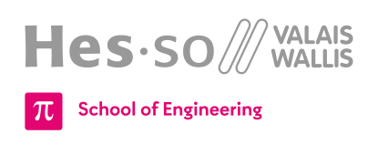

<h1 align="center">
  <br>
  
  <br>
  HEI-Vs Engineering School - Systems Engineering
  <br>
</h1>
<div align="center">
  <br>
  
  <br>
</div>

## HEI-Vs Official Logos Repository

This repository contains the official logos for the [HEI-Vs Engineering School](https://synd.hevs.io) in Sion, Switzerland. These logos are used across various projects, reports, and documentation within the HEI-Vs ecosystem.

## Available Logos

The repository contains the following categories of logos:

- **Official HEI-Vs Logos**
  - `hei-en.svg` - English & grey version
  - `hei-defr.svg` - Bilingual french/german & Grey version
  - `hei-en.black.svg` - English & black version
  - `hei-defr-black.svg` - Bilingual french/german & black version

- **Industrial Systems Logos**
  - `synd.svg` - Grey version
  - `synd-black.svg` - Black version

## Usage

To use a logo in your project, you can reference it directly from this repository or download the needed file.

### Direct Link Usage
You can use the GitHub direct permalink link to embed a logo in your documentation or website:

```markdown

```

### Local Usage
1. Clone the repository:
   ```bash
   git clone https://github.com/hei-templates/hei-synd-logos.git
   ```
2. Use the required logo in your project.

## Contributing

If you have an official logo variation to add, please follow these steps:

1. Fork the repository.
2. Create a new branch for your addition.
3. Add your logo file in the correct category.
4. Update this README file if necessary.
5. Open a pull request.

## Issues and Support

If you find an incorrect logo or need additional file formats, please open an issue in this repository. Our team will review and address it as soon as possible.

## Find us on

[hevs.ch](https://synd.hevs.io) &nbsp;&middot;&nbsp;
LinkedIn [HEI-Vs](https://www.linkedin.com/showcase/school-of-engineering-valais-wallis/) &nbsp;&middot;&nbsp;
LinkedIn [HES-SO Valais-Wallis](https://www.linkedin.com/groups/104343/) &nbsp;&middot;&nbsp;
YouTube [HES-SO Valais-Wallis](https://www.youtube.com/user/HESSOVS)
Twitter [@hessovalais](https://twitter.com/hessovalais) &nbsp;&middot;&nbsp;
Facebook [@hessovalais](https://www.facebook.com/hessovalais) &nbsp;&middot;&nbsp;
